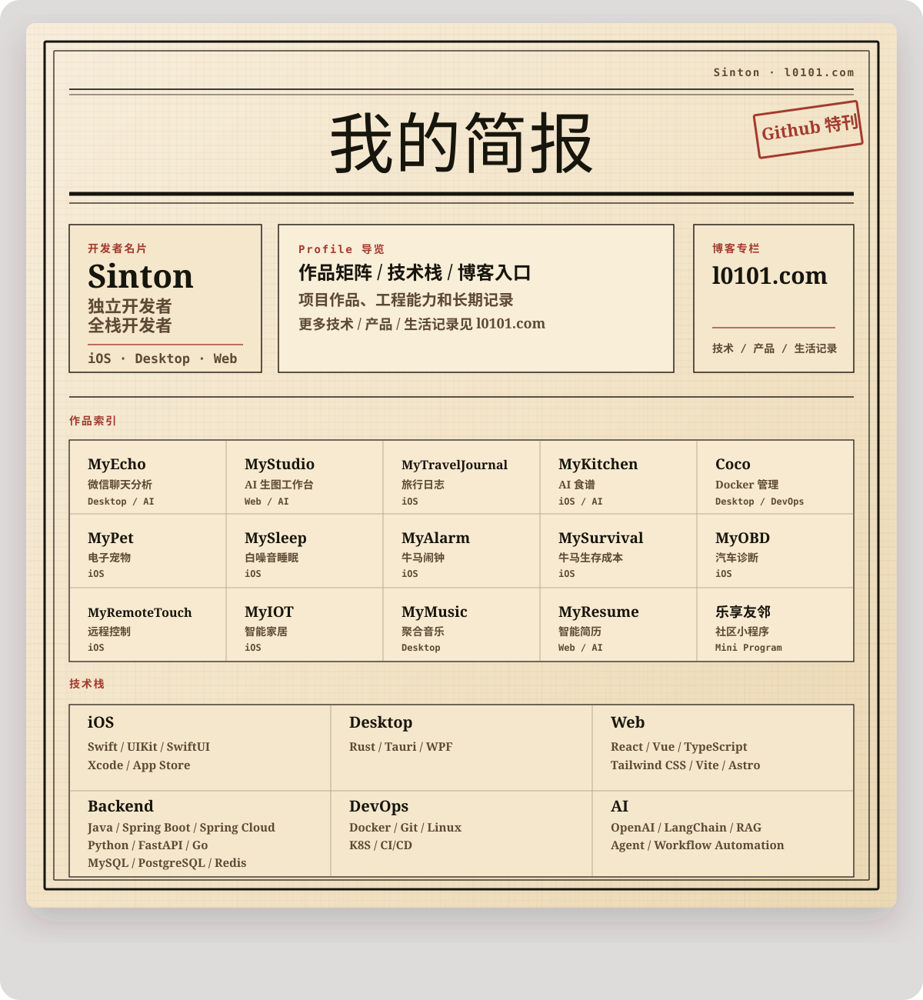

## 作品索引

<table width="100%">
  <tr>
    <td width="20%" valign="top">
      <b>MyEcho</b> 
      Desktop / AI 
      微信聊天分析
    </td>
    <td width="20%" valign="top">
      <b>MyStudio</b> 
      Web / AI 
      AI 生图工作台
    </td>
    <td width="20%" valign="top">
      <b>MyTravelJournal</b> 
      iOS 
      旅行日志
    </td>
    <td width="20%" valign="top">
      <b>MyKitchen</b> 
      iOS / AI 
      AI 食谱
    </td>
    <td width="20%" valign="top">
      <b>Coco</b> 
      Desktop / DevOps 
      Docker 管理
    </td>
  </tr>
  <tr>
    <td width="20%" valign="top">
      <b>MyPet</b> 
      iOS 
      电子宠物
    </td>
    <td width="20%" valign="top">
      <b>MySleep</b> 
      iOS 
      白噪音睡眠
    </td>
    <td width="20%" valign="top">
      <b>MyAlarm</b> 
      iOS 
      牛马闹钟
    </td>
    <td width="20%" valign="top">
      <b>MySurvival</b> 
      iOS 
      牛马生存成本
    </td>
    <td width="20%" valign="top">
      <b>MyOBD</b> 
      iOS 
      汽车诊断
    </td>
  </tr>
  <tr>
    <td width="20%" valign="top">
      <b>MyRemoteTouch</b> 
      iOS 
      远程控制
    </td>
    <td width="20%" valign="top">
      <b>MyIOT</b> 
      iOS 
      智能家居
    </td>
    <td width="20%" valign="top">
      <b>MyMusic</b> 
      Desktop 
      聚合音乐
    </td>
    <td width="20%" valign="top">
      <b>MyResume</b> 
      Web / AI 
      智能简历
    </td>
    <td width="20%" valign="top">
      <b>乐享友邻</b> 
      Mini Program 
      社区小程序
    </td>
  </tr>
</table>

## 技术栈

<table width="100%">
  <tr>
    <td width="33%" valign="top">
      <b>iOS</b> 
      Swift · UIKit · SwiftUI · Xcode · App Store
    </td>
    <td width="33%" valign="top">
      <b>Desktop</b> 
      Rust · Tauri · Electron · WPF · Cross-platform Tools
    </td>
    <td width="33%" valign="top">
      <b>Web</b> 
      React · Vue · TypeScript · Tailwind CSS · Vite · Astro
    </td>
  </tr>
  <tr>
    <td width="33%" valign="top">
      <b>Backend</b> 
      Java · Spring Boot · Spring Cloud · Python · FastAPI · Go · MySQL · PostgreSQL · Redis
    </td>
    <td width="33%" valign="top">
      <b>DevOps</b> 
      Docker · Git · Linux · K8S · CI/CD
    </td>
    <td width="33%" valign="top">
      <b>AI</b> 
      OpenAI · LangChain · RAG · Agent · Workflow Automation
    </td>
  </tr>
</table>

## 博客专栏

我在「我的简报」记录我的作品、我的随笔和我的旅行日志。

[访问博客](https://www.l0101.com)

## GitHub Telemetry

